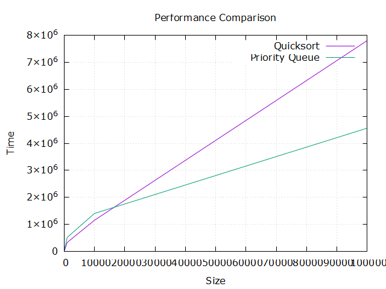

  

<h3 align="center">SortQueueComparison</h3>

---

 
The project involves comparing the performance of Java's Quicksort and Priority Queue classes for min/max extraction. It demonstrates performance using JavaFX and Gnuplot and focuses on enhancing graphical representations in Java algorithms.

## 📝 Table of Contents

- [About](#about)
- [Code Structure](#code_structure)
- [Evaluation](#evaluation)
- [Graph Visualization](#graph_visualization)
- [Prerequisites](#prerequisites)
- [Getting Started](#getting_started)
- [Usage](#usage)
- [Built Using](#built_using)
- [Authors](#authors)
- [Acknowledgements](#acknowledgement)
- [Contact](#contact)

## 🧐 About 

The project involves comparing the performance of Java's Quicksort and Priority Queue classes for min/max extraction. It demonstrates performance using JavaFX and Gnuplot and focuses on enhancing graphical representations in Java algorithms.

## 🚀 Code Structure 

The project structure includes the following files:

- `SortQueueComparison.java`: is the project's main file it contains the comparison logic between Quicksort and Priority Queue classes. It leverages JavaFX to create a line chart visualizing the performance of these classes.
- `quicksort_data.csv`: Dataset containing performance metrics for Quicksort.
- `priority_queue_data.csv`: Dataset containing performance metrics for Priority Queue.
- `plot_script.gp`: Gnuplot script generating a performance plot.
- `performance_plot.png`: Generated plot showcasing performance comparisons.

## 🎈 Evaluation 

The performance evaluation between Quicksort and Priority Queue:

### Quicksort Evaluation

- Size: 10, Time: 3500
- Size: 100, Time: 21900
- Size: 1000, Time: 326100
- Size: 10000, Time: 1149600
- Size: 100000, Time: 7812000

### Priority Queue Evaluation

- Size: 10, Time: 209500
- Size: 100, Time: 61000
- Size: 1000, Time: 513600
- Size: 10000, Time: 1401300
- Size: 100000, Time: 4564700

Evaluation:

- Quicksort demonstrates relatively lower times for smaller data sizes but significantly higher times for larger datasets.
- Priority Queue exhibits more consistent times across various data sizes.

### Comparison:

- Quicksort showcases faster performance for smaller datasets but becomes notably slower for larger data sizes compared to Priority Queue.

## 📊 Graph Visualization 

This chart visually represents the performance comparison between Quicksort and Priority Queue for different data sizes.

## 🛠️ Prerequisites 

To run the project, ensure the following are installed:

- [Java](https://www.java.com/en/download/): Download and install Java on your machine.
- [JavaFX](https://openjfx.io/): Install JavaFX and configure it in your IDE if you're using one.

Additionally:

- **Gnuplot**: Install Gnuplot and add it to the system's environment variables.

## 🏁 Getting Started 

To compile and execute the project:

1. Clone the repository or download the project files.
2. Install Gnuplot and add it to the system's environment variables if not done already.

### Using an IDE (Eclipse, VSCode, etc.)

3. Set up the JavaFX environment in your IDE.
4. Run the `SortQueueComparison.java` file.

### Using Command Line

3. Compile the Java code using the command: `javac --module-path /path/to/javafx-sdk/lib --add-modules javafx.controls SortQueueComparison.java`.
4. Run the compiled code using the command: `java --module-path /path/to/javafx-sdk/lib --add-modules javafx.controls SortQueueComparison`.
5. Execute the command `gnuplot plot_script.gp` in the project directory to generate the performance plot.

## 🎈 Usage 

You can modify the algorithms, change dataset sizes, or experiment with various scenarios to further explore the performance differences between Quicksort and Priority Queue.

## ⛏️ Built Using 

- [Java](https://www.java.com/) - Programming Language

## ✍️ Authors 

- [@AkramChaabnia](https://github.com/AkramChaabnia)

## 🎉 Acknowledgements 

- This project was given by the module instructor, <u><b>Professor Nicolas Loménie</b></u> for the advanced algorithms module at Université de Paris Cité (IF05X040 Algorithmique avancée).

## 📞 Contact 

If you have any questions, suggestions, or just want to connect, here's how you can reach me:

- Email: akram.chaabnia25@gmail.com
- LinkedIn: [Akram CHAABNIA](https://www.linkedin.com/in/akram-chaabnia-43b7941b0/)
- GitHub: [@AkramChaabnia](https://github.com/AkramChaabnia)

Please feel free to contact me!
